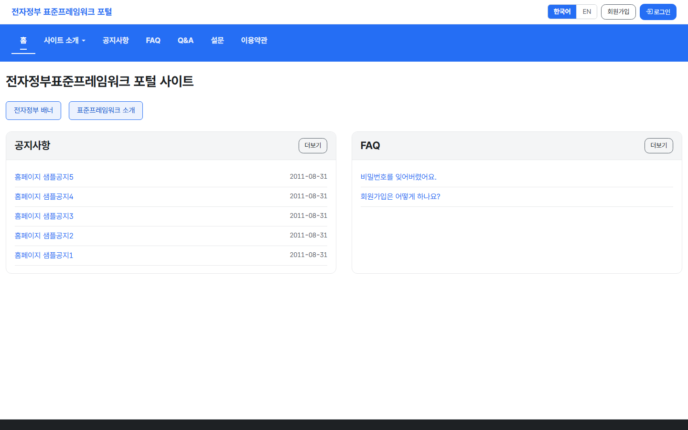
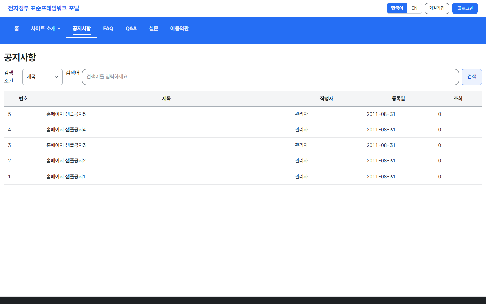
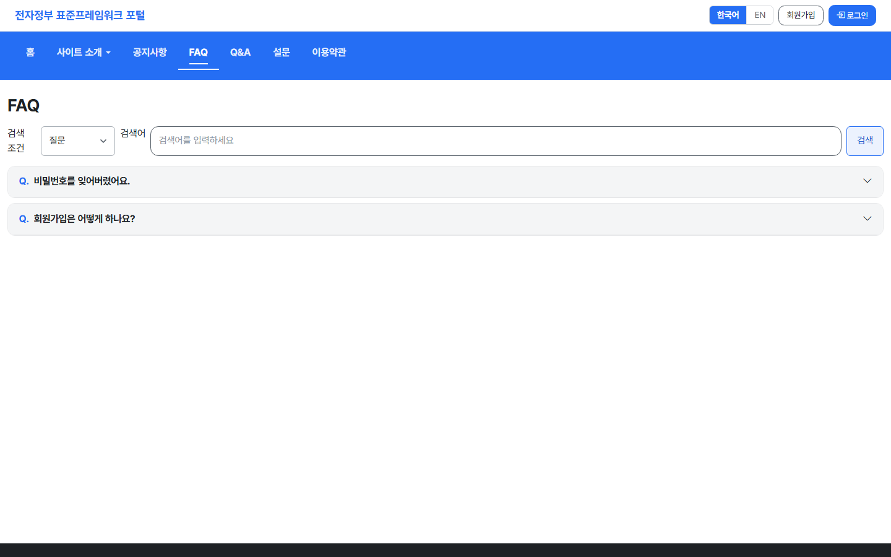
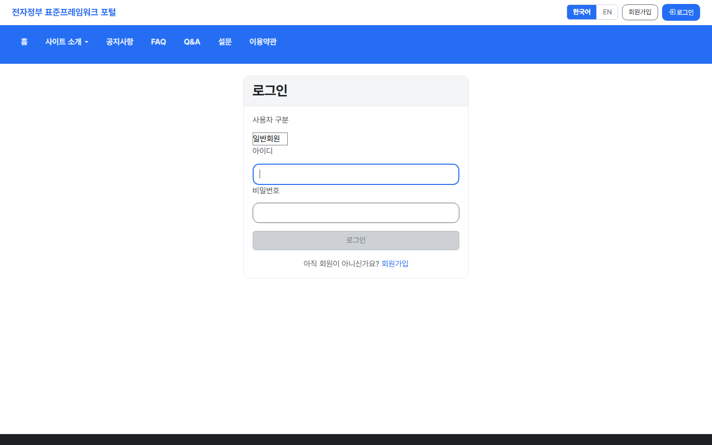
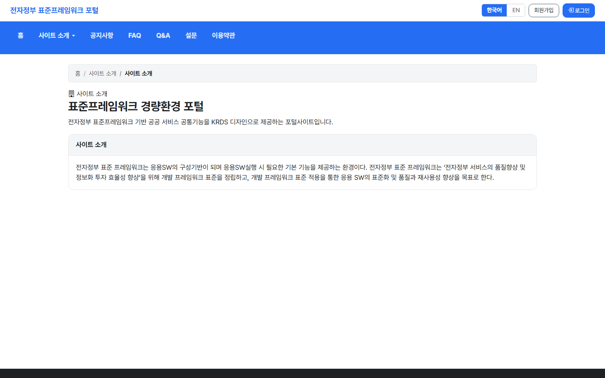

# egov-portal-react

전자정부표준프레임워크(eGovFrame) 5.0 기반 **포털 사이트** 의 React 19 프론트엔드입니다.
화면만 담고 있으며, 데이터는 별도 저장소의 REST API 백엔드에서 받아옵니다.

## 함께 쓰는 저장소

| 저장소 | 역할 | 개발 포트 |
|---|---|---|
| [egov-portal-api](https://github.com/gjh999/egov-portal-api) | REST API 백엔드 | 18090 (`/api`) |
| **egov-portal-react** (이 저장소) | React 19 프론트 | 13000 |
| [egov-portal-vue](https://github.com/gjh999/egov-portal-vue) | Vue 3 프론트 (짝) | 13001 |

두 프론트는 같은 백엔드·같은 메시지 번들·같은 KRDS 자산을 쓰며 기능이 서로 대등합니다.

> ⚠️ **`src/api/` 는 짝 저장소와 글자 하나까지 같아야 합니다.**
> 저장소가 분리돼 있어 자동으로 맞춰지지 않습니다 — 한쪽만 고치면 두 화면이 다르게 동작합니다.
> 동기화 대상과 절차는 [`src/api/CONTRACT.md`](src/api/CONTRACT.md) 를 보세요.
> 공유 파일: `client.ts` · `types.ts` · `auth.ts` · `portal.ts` (4개)

## 화면

### 메인



### 게시판



### FAQ



### 로그인



### 사이트 소개



> 위 화면은 이 저장소를 실제로 기동해 촬영한 것입니다.
> 같은 시점의 기능 점검 결과(**4 / 4 통과**)는 [docs/VERIFICATION.md](docs/VERIFICATION.md) 에 있습니다.

---


## 1. 빠른 시작

| 도구 | 버전 |
|---|---|
| Node.js | 20 이상 (권장 22) |

```bash
npm install
npm run dev     # http://localhost:13000
```

**백엔드가 먼저 떠 있어야 합니다.** [egov-portal-api](https://github.com/gjh999/egov-portal-api) 를 클론해
`mvn spring-boot:run` 으로 18090 포트에 띄우세요.

개발 서버는 `/api` 요청을 `http://localhost:18090` 로 프록시합니다(`vite.config.ts`).
프록시를 쓰면 브라우저에서 동일 출처로 보여 **쿠키가 SameSite 제약 없이 실립니다.**

백엔드 주소를 바꾸려면 `.env.development` 의 `VITE_API_BASE` 와 `vite.config.ts` 의 프록시 target 을 함께 수정하세요.

### 테스트 계정

| 계정 | ID | 비밀번호 | 권한 |
|---|---|---|---|
| 관리자 | `admin` | `1` | ROLE_ADMIN |
| 사용자 | `user` | `1` | ROLE_USER |

---

## 2. 화면 구성

### 사용자 화면

| 화면 | 내용 |
|---|---|
| 메인 | 배너 · 공지 · FAQ 요약 (API 1회 호출) |
| 로그인 | |
| 회원가입 | 약관 동의 → 정보 입력 2단계, 일반/기업 구분 |
| 사이트 소개 | 소개 · 연혁 · 조직 · 찾아오시는 길 |
| 사용자 구분 안내 | |
| 게시판 | 목록 · 상세 · 등록 · 수정 · 답변, 첨부파일 |
| FAQ | 아코디언 목록 · 등록 · 수정 |
| Q&A | 목록 · 작성비밀번호 확인 · 상세 · 등록 |
| 설문 | 참여 가능한 설문 목록 |
| 이용약관 · 개인정보처리방침 | 대표 지정본 노출 |
| 마이페이지 | 정보 조회·수정 · 비밀번호 변경 |

### 관리자 화면 (17종)

| 분류 | 화면 |
|---|---|
| 게시판 | 게시판 관리 · 게시판 사용정보 · 템플릿 |
| 콘텐츠 | 이용약관 · 개인정보처리방침 · 배너 |
| 설문 | 설문 · 설문 템플릿 · 문항 · 항목 · 응답 결과 |
| 회원·권한 | 회원 관리 · 권한 · 롤 · 그룹 |
| 시스템 | 공휴일 · 우편번호 |

SPA 관례에 맞춰 **목록·등록·수정·상세 네 화면을 목록 + 인라인 폼 하나로 합쳤습니다** —
화면을 오갈 때마다 목록을 다시 불러오고 검색 조건·페이지를 잃는 흐름을 없애기 위해서입니다.

서버 렌더링(Thymeleaf) 판에만 있고 옮기지 않은 것은 **SPA 에서 다른 방식으로 대체되는 것들**입니다:
레이아웃·프래그먼트(라우터 레이아웃), 에러 페이지(전역 오류 표시), 달력 팝업(`<input type="date">`),
파일 업로더 위젯(각 폼에 통합), 모달 프레임(인라인 폼).

---

## 3. 백엔드와의 계약

전체 내용은 [`src/api/CONTRACT.md`](src/api/CONTRACT.md) 에 있습니다. 요약하면:

### 3-1. 인증은 HttpOnly 쿠키다

로그인에 성공하면 서버가 `ACCESS_TOKEN` 쿠키를 심습니다. **응답 본문에 토큰이 없습니다** —
JS 가 읽을 수 없어 XSS 로 탈취할 수 없습니다. 대신 **모든 요청에 `credentials: 'include'`** 가 필요합니다.

토큰을 읽을 수 없으므로 로그인 여부는 앱 시작 시 `GET /auth/me` 로 서버에 물어봅니다.

### 3-2. 비밀번호는 평문으로 보냅니다 ⚠️

이 포털의 저장값은 **단일 해시** `Base64(SHA-256(id ‖ password))` 이고,
해싱은 **서버**(`EgovFileScrty.encryptPassword`)가 담당합니다.
클라이언트가 미리 해싱해 보내면 서버가 그 값을 한 번 더 해싱해 **절대 일치하지 않습니다.**

> eGovFrame 계열 템플릿 중에는 **이중 해시**를 쓰는 것도 있습니다.
> **다른 프로젝트에서 로그인 코드를 복사해 오면 인증이 통째로 깨집니다.**

평문이 네트워크에 노출되지 않도록 **운영 배포에는 HTTPS 가 필수**입니다.

### 3-3. 응답 래핑이 두 가지다

```jsonc
{ "resultCode": 200,   "result":   { ... } }   // IntermediateResultVO
{ "resultCode": "200", "resultVO": { ... } }   // 로그인 등 구형 컨트롤러
```

`src/api/client.ts` 의 `unwrap()` 이 둘을 흡수하므로 화면 코드는 차이를 몰라도 됩니다.
`resultCode` 는 HTTP 상태와 **별개**입니다 — HTTP 200 이어도 401/403/900 일 수 있습니다.

### 3-4. 페이지네이션은 서버가 계산한다

응답의 `paginationInfo` 에 페이지 범위가 들어 있습니다. 클라이언트에서 다시 계산하면 반드시 어긋납니다.

### 3-5. Q&A 상세는 비밀번호 확인을 먼저 거친다

비회원도 글을 남길 수 있어 본인 확인 수단이 작성비밀번호뿐입니다.
`POST /qna/{qaId}/verify` 로 확인한 뒤에 상세를 요청합니다 — 조회 URL 에 비밀번호가 남지 않게 하기 위해서입니다.

### 3-6. 게시물 답변의 트리 위치는 서버가 정한다

부모·정렬·깊이(`parnts`·`sortOrdr`·`replyLc`)를 프론트가 보내지 않습니다.
서버가 원글에서 읽어 채우므로 요청 본문에 넣어도 무시됩니다.

---

## 4. 빌드 · 배포

```bash
npm run build   # → dist/
```

`dist/` 를 정적 서버(nginx 등)에 배포합니다.
**SPA 이므로 History 폴백이 필요합니다** — 하위 경로로 새로고침했을 때 404 가 나지 않도록
모든 경로를 `index.html` 로 보냅니다.

```nginx
location / {
    try_files $uri $uri/ /index.html;
}
location /api/ {
    proxy_pass http://127.0.0.1:18090;
    proxy_set_header Host $host;
}
```

프론트와 API 를 **같은 도메인**에 두면(위 설정처럼 `/api` 를 프록시) 쿠키 문제가 생기지 않습니다.

### 컨테이너로 실행

저장소에 `Dockerfile` 과 `k8s/` 매니페스트가 들어 있습니다.
이미지는 **정적 번들 + nginx** 구성이고, nginx 가 `/api` 를 백엔드로 넘깁니다.

```bash
docker build -t egov-portal-react:latest .
docker run --rm -p 13000:8080 -e BACKEND_URL=http://host.docker.internal:18090 egov-portal-react:latest
```

세 저장소를 한 번에 띄우려면 [egov-portal-api](https://github.com/gjh999/egov-portal-api) 의
`docker-compose.yml` 을 쓰세요 — 백엔드 1 + 프론트 2 가 함께 뜹니다.
도메인을 분리한다면 백엔드에서 `JWT_COOKIE_SAMESITE=None` + `JWT_COOKIE_SECURE=true`(HTTPS) +
CORS 화이트리스트가 **모두** 필요합니다.

---

## 5. 테스트

```bash
npm run lint    # ESLint
npm run test    # Vitest 7건
```

| 무엇을 지키는가 |
|---|
| 응답 래핑 흡수 (`result` / `resultVO` 두 형태) |
| 401 처리 — 인증 만료 시 앱 상태가 로그아웃으로 돌아가는지 |
| 모든 요청에 쿠키가 실리는지 (`credentials: 'include'`) |
| 빈 쿼리 파라미터가 URL 에서 제외되는지 |

---

## 6. 디자인 · 접근성

화면은 **KRDS(디지털정부 표준 디자인시스템)** 를 따릅니다.

- 공식 KRDS HTML Component Kit 을 `public/krds/` 에 **로컬 사본**으로 둡니다 (CDN 미사용 정책).
- CSS 로드 순서를 지켜야 합니다:
  `bootstrap-icons` → `krds.min.css` → `common.css` → `krds-compat.css` → `krds.css`
  (`krds-compat.css` 는 KRDS 가 제공하지 않는 그리드·유틸리티를 KRDS 토큰으로 재구현한 호환 레이어입니다 —
  제거하면 레이아웃이 무너집니다.)
- 폰트는 Pretendard GOV (`public/krds/resources/fonts/`).
- 접근성(KWCAG 2.2): 본문 바로가기 링크, 표의 `caption`·`scope`, 폼 `label` 연결,
  현재 페이지 `aria-current`, 상태 변화 `aria-live`, 아코디언 `aria-expanded`.

새 컴포넌트를 추가할 때 **KRDS 클래스명(`krds-*`)을 재정의하지 마세요.** 기존 스타일과 충돌합니다.

---

## 7. 프로젝트 구조

```
src/
├── api/            ★ 짝 저장소와 동일해야 하는 계층 (CONTRACT.md 참조)
│   ├── client.ts   fetch 래퍼 · 응답 래핑 흡수 · 401 처리
│   ├── types.ts    서버 DTO 타입
│   ├── auth.ts     로그인 · 로그아웃 · 현재 사용자
│   └── portal.ts   게시판 · FAQ · Q&A · 설문 · 약관 · 배너 · 회원 · 권한 · 시스템
├── auth/           인증 상태 컨텍스트
├── i18n/           서버 메시지 번들 로딩 (GET /api/i18n/{ko|en})
├── components/     레이아웃 · 페이지네이션 · 로딩/오류 표시 · 관리자 CRUD 골격
├── pages/          화면 (admin/AdminPages.tsx 에 관리자 17종)
└── test/           Vitest
```

**관리자 화면 17종은 하나의 골격(`AdminCrudPage`)을 공유합니다.** 도메인마다 다른 것은
컬럼 정의·필드 정의·API 호출 세 가지뿐이라, 화면을 추가할 때는
`src/pages/admin/AdminPages.tsx` 에 컴포넌트 하나만 더하면 됩니다.

**생성·수정·삭제 핸들러를 빼면 조회 전용 화면이 됩니다** — 감사 대상인 로그 화면 등에 씁니다.

---

## 8. 다국어

화면 문구의 원본은 **백엔드**([egov-portal-api](https://github.com/gjh999/egov-portal-api))의
`message-ui_{ko,en}.properties` 입니다. 앱 시작 시 `GET /api/i18n/{lang}` 으로 받아 씁니다.

문구는 `t('key', '기본값')` 형태로 씁니다. 두 번째 인자는 번들에 키가 없을 때 쓰이는 대비값입니다.

> 화면 문구 키 254 개 중 **251 개(99%)** 가 번들에 등록돼 있어 언어 전환이 실제로 동작합니다.
> 나머지 2 개는 첨부 최대 개수처럼 **값이 끼어드는 문구**라, 번들로 옮기려면 자리표시자 치환이 필요합니다. 대비값으로 둡니다.

문구를 이 저장소에 박아 두면 짝 저장소와 갈라집니다. **새 문구는 백엔드 메시지 파일에 추가**하세요.

---

## 라이선스

Apache License 2.0 — [LICENSE](LICENSE)

전자정부표준프레임워크 포털 사이트 템플릿을 기반으로 합니다.
